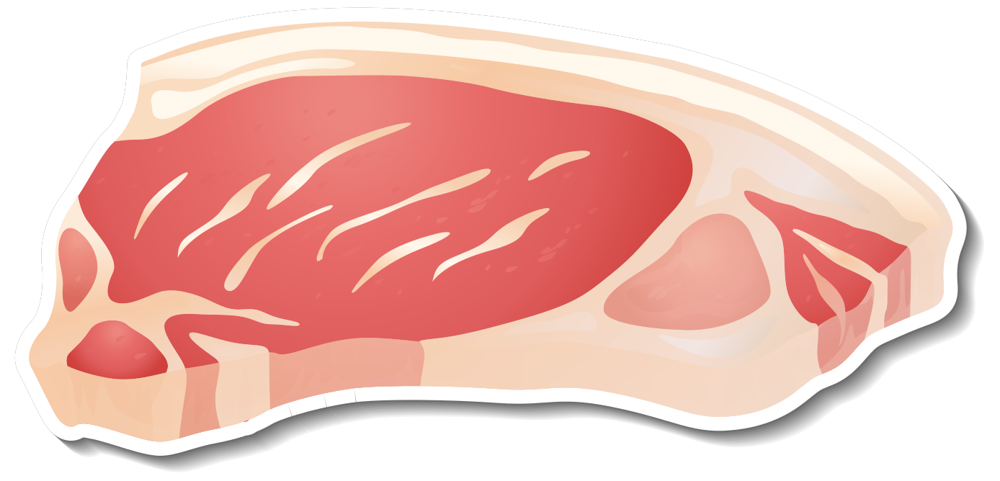

# Meat Club

[](https://app.netlify.com/sites/meatclub-website/deploys)

---



> A simple react.js and tailwind CSS website for selling meat to your customers.

---

**Technologies used:**

- React.js
- Tailwind CSS

---

**Configuration:**

1. After cloning the respository, install the dependencies:

- using npm:

```
npm install
```

- using yarn:

```
yarn
```

2. To run the application locally you can utilize the start script:

- using npm:

```
npm run start
```

- using yarn:

```
yarn start
```

**Live Demo:**

You can check a live demo of the app running [here](https://meatclub-website.netlify.app)
